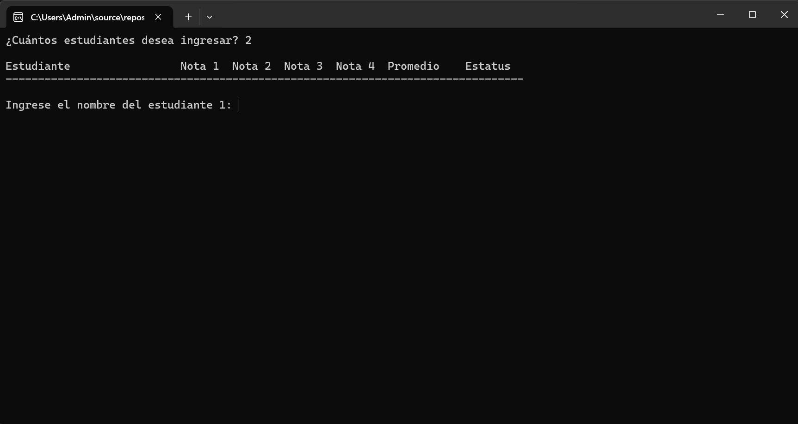
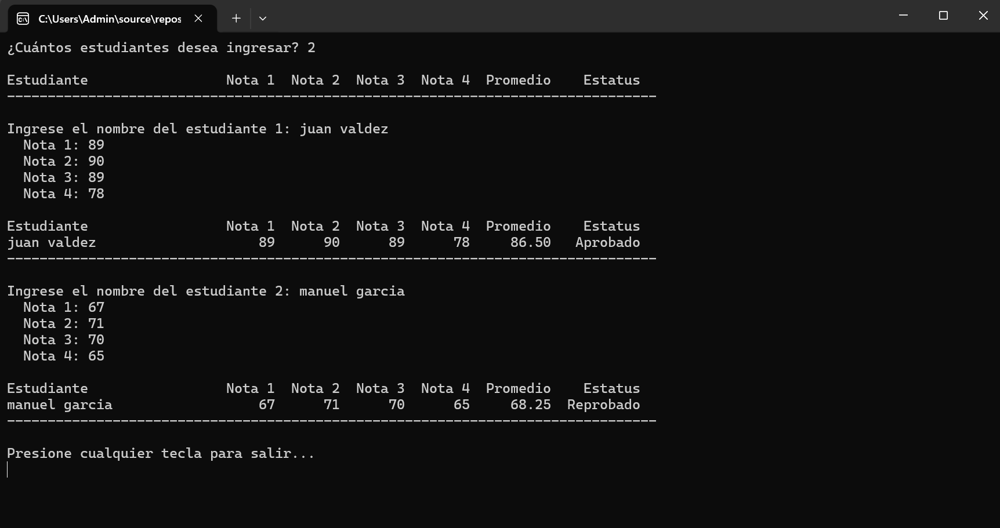

# Sistema de Cálculo de Promedio de Estudiantes - Consola

##  Descripción del Proyecto

Este proyecto consiste en una aplicación de consola desarrollada en C# que permite ingresar las calificaciones de múltiples estudiantes utilizando bucles.

El programa solicita al usuario introducir el nombre y las 4 calificaciones de cada estudiante, calcula el promedio y determina si el estudiante aprobó o reprobó según su resultado.

El proceso se repite para una cantidad indefinida de estudiantes (n estudiantes), controlado mediante estructuras repetitivas.

---

##  Objetivos

- Aplicar el uso de bucles (for / while)
- Utilizar estructuras condicionales
- Calcular promedios
- Mostrar resultados en pantalla
- Practicar lógica de programación

---

##  Tecnologías Utilizadas

- C#
- .NET
- Aplicación de Consola
- Programación Estructurada

---

##  Funcionamiento del Programa

1. El sistema solicita las 4 calificaciones del estudiante.
2. Calcula el promedio.
3. Determina si:
   - ? Aprobó
   - ? Reprobó
4. Permite ingresar otro estudiante.
5. Muestra el resultado en pantalla.

---

##  Capturas del Programa en Ejecución

### ?? Ingreso de Calificaciones

### ?? Resultado Final (Aprobado/Reprobado)

